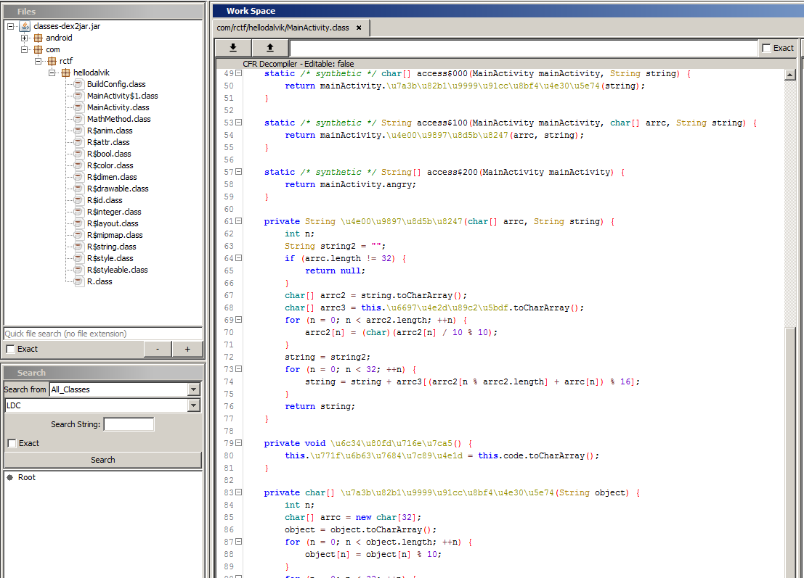
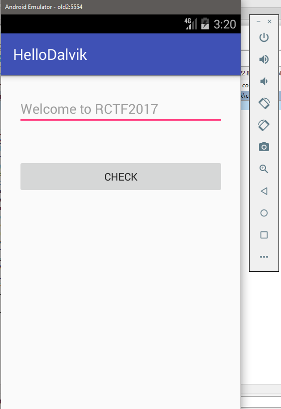
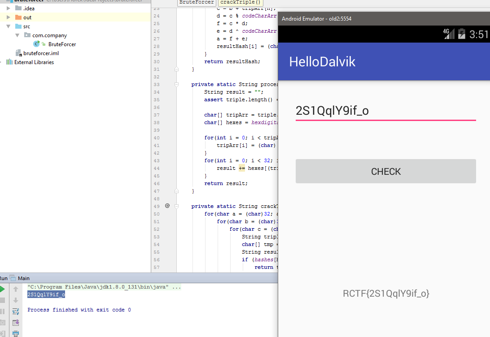

# HelloDalvik 645 pts

### Author: florek

We start with an apk file `HelloDalvik.apk`. After unzipping it we get standard set of android application files like `classes.dex` but also natively compiled library. Application most likely uses this native library, and fortunately for us it was built for multiple platforms including x86 so it can be analyzed more easily.
We are also told that apk requires `API < 21` to run, which implies that it needs `Dalvik VM` instead of `ART` to run, which is suspicious.

To analyze this application we have to process `classes.dex` to get _java code_ or _smali_, but since it isn’t obfuscated, decompiled java code is easily readable.

Decompilation could simply be done using the following command:
```
d2j-dex2jar.bat C:\Workspace\Files\classes.dex
```

As an output we get `classes-dex2jar.jar` which can be further decompiled with `BytecodeViewer` (FernFlower decompiler).



Most interesting files for us are: `MainActivity.class`, `MainActivity$1.class` and `MathMethod.class`. The rest of the files are android libraries. To ease analysis those files can be exported to text files with some (especially unicode) identifiers renamed.

Here are the files after "deobfuscation":
* [MainActivity](MainActivity.java)
* [MainActivity$1](MainActivity$1.java)
* [MathMethod](MathMethod.java)

First thing that can be noticed is that native library is used only in one place:
```java
    public MainActivity() {
        System.loadLibrary("native-lib");
        Log.d("Have Fine! ", this.stringFromJNI() + "");
    }
    public native int stringFromJNI();  
```
It can be ignored for now. To better understand what is going on it's helpful to run this apk, we can setup `AVD` with an old enough OS to run it (eg. `Android 4.4 KitKat`).

To install the application simply type:
```
adb install HelloDalvik.apk
```



All processing is done after `CHECK` button is clicked, following this in decompiled code we get:

```java
    public void onClick(View var1) {
      String var5 = String.valueOf(this.val$editText.getText());
      String var8 = "";
      boolean var3 = false;
      char[] var6 = var5.toCharArray();

      for(int var2 = 0; var2 < var6.length; var8 = var5) {
         boolean var4 = var3;
         var5 = var8;
         if(var2 % 3 == 0) {
            var5 = "";

            for(int var9 = 0; var9 < 3; ++var9) {
               var5 = var5 + var6[(var2 + var9) % var6.length];
            }

            char[] var7 = MainActivity.process_1(this.this$0, var5);
            this.val$kk[0] = MainActivity.process_2(this.this$0, var7, var5);
            if(this.val$kk[0].equals(MainActivity.angryHashArray(this.this$0)[var2 / 3 % 4])) {
               var5 = var8 + var5;
               var4 = var3;
            } else {
               this.val$tv.setText("Too Young!!");
               var4 = true;
               var5 = var8;
            }
         }

         ++var2;
         var3 = var4;
      }

      if(!var3) {
         this.val$tv.setText("RCTF{" + var8 + "}");
      }

   }
```

User input is divided into 3 characters long chunks and processed with two function calls, after that result is compared with precalculated hashes.
Because computation is done on very short strings, writing a brute-forcer is the easiest option to find the correct input.

Processing functions:
```java
 private char[] processString1(String var1) {
      char[] var3 = new char[32];
      char[] var4 = var1.toCharArray();

      int var2;
      for(var2 = 0; var2 < var4.length; ++var2) {
         var4[var2] = (char)(var4[var2] % 10);
      }

      for(var2 = 0; var2 < 32; ++var2) {
         this.int_8 = (new MathMethod()).rem(var2, var4.length);                
         this.int_2 = (new MathMethod()).rem(var2, this.codeCharArr.length);    
         this.int_3 = (new MathMethod()).div(this.int_2, var4[this.int_8]);        
         this.int_4 = (new MathMethod()).plus(this.int_3, this.codeCharArr[this.int_2]);    
         this.int_6 = (new MathMethod()).mul(this.int_3, this.int_4);            
         this.int_5 = (new MathMethod()).xor(this.int_4, this.codeCharArr[this.int_8]);
         this.int_1 = (new MathMethod()).div(this.int_6, this.int_5);    
         var3[var2] = (char)(this.int_1 & this.int_7);
      }

      return var3;
   }
  private String processString2(char[] var1, String var2) {
      String var4 = "";
      if(var1.length != 32) {
         return null;
      } else {
         char[] var5 = var2.toCharArray();
         char[] var6 = this.hexdigits.toCharArray();

         int var3;
         for(var3 = 0; var3 < var5.length; ++var3) {
            var5[var3] = (char)(var5[var3] / 10 % 10);
         }

         var3 = 0;

         for(var2 = var4; var3 < 32; ++var3) {
            var2 = var2 + var6[(var5[var3 % var5.length] + var1[var3]) % 16];
         }

         return var2;
      }
   }
```
Above functions can be copied into brute-forcer source code. After trying to run this code we get ``Divided by zero exception`` and indeed after further investigation it turns out that this code will always result in dividing by zero, no matter what the input is. But application runs in AVD so it just must work. The only explanation left is that native library does some kind of code hot patching and it actually does just that.
When analyzing native android libraries it is useful to load `jni.h` file into IDA since it contains many useful enum and struct definitions.

First thing this native function does is it decodes some strings by simply adding a value to every character. Those strings are:
```
/data/dalvik-cache/data@app@com.rctf.hellodalvik
MathMethod_1
MathMethod_4
Lcom/rctf/hellodalvik/MathMethod;
```
After that it tries to find DEX file in process memory, by searching for its header in range parsed from `/proc/$PID/maps`, when header is found it calls the patch function twice. Once for `MathMethod_1` once and for `MathMethod_4`. Patch function does some DEX format parsing and at the very end calls `mprotect` to enable code patching without causing access violation exception. Based on the last parameter passed to this function the correct data is written into previously unprotected address.

This written data seems to be Dalvik opcodes corresponding to mul-int, rem-int and add-int operations:
```
.data:0002E004                 public mul_opcodes
.data:0002E004 mul_opcodes     db  92h ;             ; mul opcode
.data:0002E005                 db    0
.data:0002E006                 db    2
.data:0002E007                 db    3
.data:0002E008                 db  0Fh
.data:0002E009                 db    0
.data:0002E00A                 public rem_opcodes
.data:0002E00A rem_opcodes     db  94h ;              ; DATA XREF: .got:off_2DD44
.data:0002E00A                                         ; rem opcode
.data:0002E00B                 db    0
.data:0002E00C                 db    2
.data:0002E00D                 db    3
.data:0002E00E                 db  0Fh
.data:0002E00F                 db    0
.data:0002E010                 public add_opcodes
.data:0002E010 add_opcodes     db  90h ;              ; DATA XREF: .got:off_2DD48
.data:0002E011                 db    0
.data:0002E012                 db    2
.data:0002E013                 db    3
.data:0002E014                 db  0Fh
.data:0002E015                 db    0
```

So `MathMethod_4` is patched with addition opcode and `MathMethod_1` is patched with reminder opcode. With that we can fix brute-forcer.
Sure enough it works this time.



Flag: `RCTF{2S1QqlY9if_o}`

* [Native module analysis](native.c)
* [Brute-forcer](BruteForcer.java)
