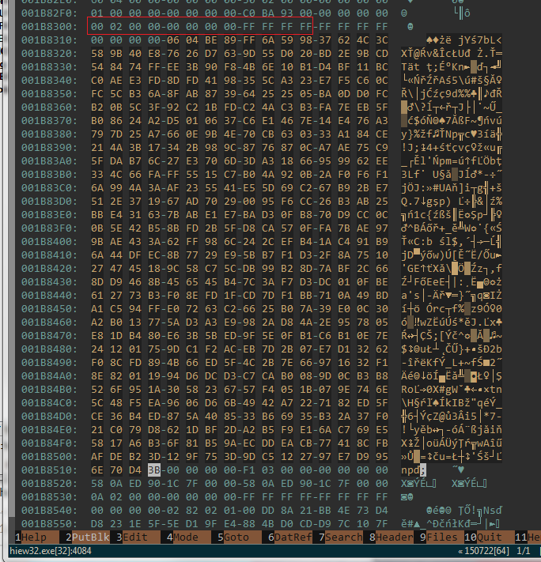

# Locky Forensics 300 + 50 pts

### Author: florek

We are given `memory.dmp` file that is supposed to be a memory dump of ransomware infected PC. File is 256 MB.
First step is to identify used OS, simplest way is to search for some string like *debian*, *ubuntu*, *windows* or use binwalk that will find a bunch of unix paths. 

After quick search it looks like a debian, so we can download appropriate [volatility profiles](https://github.com/volatilityfoundation/profiles/tree/master/Linux/Debian/x64). With those profiles we can do some investigation. [Here are useful profile commands](https://github.com/volatilityfoundation/volatility/wiki/Linux-Command-Reference)

Exact OS version
```bash
> volatility-2.5.standalone.exe --plugins=profiles --profile=LinuxDebian86x64 linux_banner -f d:\workspace\CTFS\Sharif16\memory.dmp

Linux version 3.16.0-4-amd64 (debian-kernel@lists.debian.org) (gcc version 4.8.4 (Debian 4.8.4-1) ) #1 SMP Debian 3.16.36-1+deb8u2 (2016-10-19)
```
Despite deb8u2 version it looks like profile LinuxDebian86x64 works better than LinuxDebian82x64 so I will keep using it

Executed commands 
```bash
> volatility-2.5.standalone.exe --plugins=profiles --profile=LinuxDebian86x64 linux_bash -f d:\workspace\CTFS\Sharif16\memory.dmp

Pid      Name                 Command Time                   Command
-------- -------------------- ------------------------------ -------
	...
     610 bash                 2016-11-30 12:54:50 UTC+0000   rm file_*
     610 bash                 2016-11-30 12:54:50 UTC+0000   grep -ril "BEGIN PUBLIC KEY"
     610 bash                 2016-11-30 12:54:50 UTC+0000   cat .locky_1480503269
     610 bash                 2016-11-30 12:54:50 UTC+0000   head -c 10 file_2.locky | hexdump
     610 bash                 2016-11-30 12:54:50 UTC+0000   apt-get install binutils
     610 bash                 2016-11-30 12:54:50 UTC+0000   hexdump -C file_3
     610 bash                 2016-11-30 12:54:50 UTC+0000   apt-get install curl
     610 bash                 2016-11-30 12:54:50 UTC+0000   hexdump -C file_3.locky
     610 bash                 2016-11-30 12:54:50 UTC+0000   head -c 10 | hexdump
     610 bash                 2016-11-30 12:54:50 UTC+0000   rm privkey.pem
     610 bash                 2016-11-30 12:54:50 UTC+0000   ./run.sh
     610 bash                 2016-11-30 12:54:50 UTC+0000   cd dump/
     610 bash                 2016-11-30 12:54:50 UTC+0000   dd if=/dev/fmem of=memo.dmp bs=1M count=256
	... (some elements removed)
```
We can see here some post infection actions, like removing the private key. We can also see some *.locky files

Running processes
```bash
> volatility-2.5.standalone.exe --plugins=profiles --profile=LinuxDebian86x64 linux_pslist -f d:\workspace\CTFS\Sharif16\memory.dmp

Offset             Name                 Pid             Uid             Gid    DTB                Start Time
------------------ -------------------- --------------- --------------- ------ ------------------ ----------
...
0xffff88000d1615f0 login                496             0               0      0x000000000d0c2000 0
0xffff88000a6e0190 fail2ban-server      503             0               0      0x000000000d399000 0
0xffff88000bc162d0 bash                 530             0               0      0x000000000dc1e000 0
0xffff88000cbf6b60 bash                 610             0               0      0x000000000d032000 0
0xffff88000a4fe210 python               617             0               0      0x000000000dfcf000 0
0xffff88000a5b0310 dd                   652             0               0      0x000000000d15b000 0
```

By searching for `locky` string in the memory dump we can find a part of python script that was used to infect the system. Following this lead we can try to dump `python's` heap and and recover some of its objects.

```bash
> volatility-2.5.standalone.exe --plugins=profiles --profile=LinuxDebian86x64 linux_proc_maps -p 617 -f d:\workspace\CTFS\Sharif16\memory.dmp

Offset             Pid      Name                 Start              End                Flags               Pgoff Major  Minor  Inode      File Path
------------------ -------- -------------------- ------------------ ------------------ ------ ------------------ ------ ------ ---------- ---------
...
0xffff88000a4fe210      617 python               0x0000000000caa000 0x0000000000e6c000 rw-                   0x0      0      0          0 [heap]
...
> volatility-2.5.standalone.exe --plugins=profiles --profile=LinuxDebian86x64 linux_dump_map -p 617 -s 0x0caa000 -f d:\workspace\CTFS\Sharif16\memory.dmp --dump-dir=dump

Task       VM Start           VM End                         Length Path
---------- ------------------ ------------------ ------------------ ----
       617 0x0000000000caa000 0x0000000000e6c000           0x1c2000 dump\task.617.0xcaa000.vma
```
Dumped file has only 2MB and contains all the information that we need to recover encrypted files. To get the list of encrypted files, we can use the following command:
```bash
> volatility-2.5.standalone.exe --plugins=profiles --profile=LinuxDebian86x64 linux_enumerate_files -f d:\workspace\CTFS\Sharif16\memory.dmp

     Inode Address Inode Number              Path
------------------ ------------------------- ----
...
0xffff880000c3ec80                   1966090 /root/.locky_1480510736
0xffff88000cceac80                   1966091 /root/file_3.locky
0xffff88000ccea898                   1966092 /root/file_4.locky
0xffff88000992dc80                   1966088 /root/file_5.locky
0xffff8800099aa0c8                   1966089 /root/file_1.locky
0xffff8800099aa4b0                   1966093 /root/file_2.locky
```
Unfortunately trying to dump those files using `linux_find_file` yields empty 512 B files, but we get the correct size which will be useful later.

By examining python's heap we can find following elements:
* [Ransomware code at the beginning](ransomware.py)
* [Public key in PEM format](publickey.pem) (searching for `----BEGIN PUBLIC`)
* [Private key in PEM format](privatekey.pem) (searching for `---BEGIN RSA`)

Ransomware script encrypted files using 4096 bit RSA. Every file was encrypted multiple times:
```python
home = expanduser("~")
files = glob.glob(home + '/*')
LC, i = [], 0
for f in files:
    if isfile(f):
        if not f.endswith('.locky'):
            fd = open(f, 'r')
            g = open(f + '.locky', 'w')
            round = stamp % 14
            msg = fd.read()
            for _ in xrange(round):
                msg = privkey.encrypt(msg, 0)[0]
            LC.append(msg)
```
Here is script that will decrypt those files using extracted private key:
```python
from Crypto.PublicKey import RSA
privkey = open('privatekey.pem').read()
decryption_key = RSA.importKey(privkey)
iterations = 1480510736 % 14	# timestamp recovered from file listing

for i in range(1, 6):
	data = open('file_%d.locky' % (i,), 'rb').read()
	for _ in range(iterations):
		data = decryption_key.decrypt(data)
	open('file_%d.dec' % (i,), 'wb').write(data)
```

Now all we have to do is to extract encrypted files and run decrypter on them. Fortunately ransomware stored encrypted files in a `LC` list, so it should be possible to find them in memory. To get an idea what to look for to identify those list elements we can create simple python script that fills in the list with `0xAA` bytes, dump its heap and look for those bytes in memory. It looks like the list entries are proceeded by `size 00000000 FFFFFFFF` sequence and are located near the end of heap. 
We can now look for `00020000 00000000 FFFFFFFF ` (`00020000` is 512 in little endian) to locate our files. Since files are encrypted their entropy will be high, this fact also helps locating them.
Encrypted files can be dumped using for example hiew:



After running decryption script on extracted files `file_4` contains our flag `SharifCTF{df90036c153c345dc707d693225f29e3}`