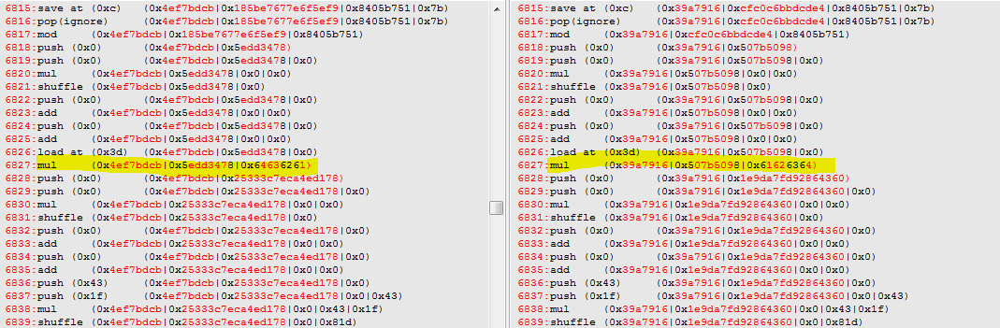
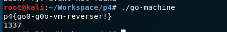

Go Machine 
==========
#### Reversing, 306pts, 10 sovles

Overview
--------------------------------

As one may guess from the task title, this is a binary written in Go. Furthermore it implements custom virtual machine. To make finding the actual main function easier I used [IDAGolangHelper](https://github.com/sibears/IDAGolangHelper), an awesome IDA script that renames function based on metadata found in the binary. After running this script, main function can be found under **main_main** name.

Looking at the function graph and decompiled snipped it seems that indeed this is a vm.

vm analysis
---------------------------
At the beginning it loads the bytecode of size `0x32ABE` from address `0x04BE653`. My initial idea was to do everything that avoids analyzing it, because of its size :) I started from analyzing handlers
### Handlers
This vm has 15 handlers and is a stack-based one. The latter part becomes apparent after analyzing a few handlers. Here are supported operations, most of them pops operands from the top of the stack, and then pushes back the result.

* Subtract `stack[top-1] = stack[top-1] - stack[top]; top--;`
* Add `stack[top-1] = stack[top-1] + stack[top]; top--;`
* Negate `stack[top] = ~stack[top];`
* Multiply `stack[top-1] = stack[top-1] * stack[top]; top--;`
* Modulo `stack[top-1] = stack[top-1] % stack[top]; top--;`
* Push immediate `stack[++top] = imm;`
* Pop and ignore `top--;`
* Read char `stack[++top] = char;`
* Write char `print stack[top];`
* Duplicate `stack[top+1] = stack[top]; top++;`
* Store at addr `mem[addr] = stack[top];`
* Load from addr `stack[top] = mem[addr];`
* Pop to top-1	`stack[top-1] = stack[top]; top--;`
* Shift left `stack[top-1] = stack[top-1] << stack[top]; top--;`
* Compare `stack[top-1] == stack[top]`
* Shuffle

Most of them are simple arithmetic operations, or memory loads/stores. Except the last one.  
vm determines the handler to be executed based on finding current opcode's index in string `0123456789OEQLCI`. If for example currently executing instruction is `L` it will find that its index is 13, and execute handler number 13 (shift left). But when handler **Shuffle** is executed it shuffles this string. As a result, opcodes change their meaning. After **Shuffle** aforementioned string could look like this `ECI031456O7982LQ` and now instruction `L` has index 14 and executes completely different handler (compare). What is more interesting,  **Shuffle** handler is implemented using LCG generator:

```c
qword_56F0C0 = v131;
for ( j = 15LL; j > 0; j = v127 - 1 )
{
  v128 = result;
  v127 = j;
  v139 = (unsigned int)(0x19660D * qword_56F0C0 + 0x3C6EF35F) % (unsigned __int64)j;
  qword_56F0C0 = (unsigned int)(0x19660D * qword_56F0C0 + 0x3C6EF35F);
  v140 = *((_BYTE *)&handler_list + v127);
  if ( v139 >= 0x10 )
    runtime_panicindex(v127, result, v139, v131);
  v129 = *((unsigned __int8 *)&handler_list + v139);
  *((_BYTE *)&handler_list + v127) = v129;
  *((_BYTE *)&handler_list + v139) = v140;
} 
```

Number used as a seed to this LCG is a result of previously executed vm operations. Each handler updates it in a unique way. This makes rewriting such a vm a much more error prone task.

Compare handler is also interesting. When it fails a loop that zeros stack, bytecode and memory is executed. This results in application crashing.


Different approaches
---------------------
As stated previously I wanted to avoid writing bytecode disasembler/emulator at all cost due to perceived difficulty. Here are few observations that I made, that later lead me to solving the task.

1. Compare handler is used to check the flag for correctness (duh), it compares hash calculated based on user input with expected one.
2. Hash is calculated from four characters. I checked that by feeding the program two strings `aaaabbbbbbbbbbbbbbb` and `aaaaaaaaaaaaaaaaaa` for both of them first comparison was the same. Hence only four characters are used.
3. It is therefore possible to find the input that produces correct hashes by bruteforcing four characters long inputs

### IDAPython approach
I figured that I could script debugger in such a way that it will feed the program with four characters combinations and break on comparison checking if a correct hash was generated.  
The idea is sound, but in reality it was way too slow. I was able to get the first part of the flag `p4{g` and that's only because I already knew first three letters :P

### Recording and replaying the trace
Since I already figured out scripting IDA debugger I might as well use it again.
I decided to dump all the instructions executed by the VM, that way I will get correct instruction trace, no need to rewrite anything. That's all assuming that instruction trace doesn't change based on the user input, which is the case here.  
Here is my [script](dump_vm_trace.py) that creates conditional breakpoint at the instruction dispatcher and dumps the currently executed instruction. Additionaly it dumps current stack state.   
Here is a trace snippet:

```
push (0x0)	(0x61000000|0x610000|0x6100|0x0)
add	(0x61000000|0x610000|0x6100|0x0|0x0)
load at (0xd)	(0x61000000|0x610000|0x6100|0x0)
add	(0x61000000|0x610000|0x6100|0x61)
add	(0x61000000|0x610000|0x6161)
add	(0x61000000|0x616161)
save at (0x3c)	(0x61616161)        # user input was 'aaaa'
pop(ignore)	(0x61616161)
push (0x0)	
push (0x0)	(0x0)
mul	(0x0|0x0)
shuffle	(0x0)
```

Having this dump I tried to duplicate my original idea. But this time not in a debugger but in python emulated environment. I wrote a script that parses whole trace dump and replays it. It also feeds different four chararacter sequences and checks the resulting hash. Here is a snippet of that script:

```python
elif line.startswith('shuffle'):
	pass
elif line.startswith('read_input'):
	top += 1
	stack[top] = ord(flag[flag_ctr])
	flag_ctr += 1
elif line.startswith('save at'):
	val = int(line[line.index('(')+1: line.index(')')], 16) 
	mem[val] = stack[top]
elif line.startswith('load at'):
	val = int(line[line.index('(')+1: line.index(')')], 16) 
	stack[top] = mem[val]

# calculated hash is written at this offset to be compared later
# no need to replay further
if line.startswith('save at (0x51)'):
	return stack[top] == expected_hash
```  

Huge advantage over full blown vm interpreter is that I didn't need to parse raw bytecode and handle shuffle operations, that as already explained is a bit tricky.  
Unfortunately this solution proved to be too slow to check every combination, even when I tried to optimize it.

### Trace analysis and comaprsion
Funny thing is that despite tring so hard not to analyze the bytecode I already analyzed it quite a bit by reading vm trace and finding for example location where calculated hash is stored.  
Having failed with my previous _clever_ attempts I decided to dump traces for two simillar user inputs and compare them in order to understand what is this vm actually doing. And this turned out not to be as hard as I expected at first.
Here is a trace comparison for inputs `abcd` and `dcba`

I noticed that a lot of values are the same, so it was easy to scroll through the trace and identify important places. First input is multiplied by itself, as shown on above picture. Then `mod 0x8405b751` of that multiplication is calculated

The result is again multipied by itself and modulo is calculated.
This process repeats 8 times, and at the end it is multipied by unmodified input and `mod 0x8405b751` of that is the final hash. 

Calculated hash is stored in memory, starting at `0x50`


So the algorithm turns out to be really simple:
```python
def calc_hash(input, mod):
    val = input
    for i in range(8):
        val = val*val % mod
    return val*input % mod
``` 
Let's test it:


We get the same results.  
Checking out next parts of the flag, their hashes are calculated the same, just modulo is different.  
Only thing left to do is to collect expected hashes, and write a script that will brute force correct inputs. Hashes can be extracted from trace, just remember that program will crash when the first mismatch occurs. Se either re-run the trace after each four characters input is found, or patch the comparison.


Here is the final script:
```python
import string
import itertools
import sys
import struct

mod = [0x88ca6b51, 0x8405b751, 0xbfa08c87, 0x82013f23, 0x4666751b, 0x5271083f]
expected = [0xf2227a5, 0x4e053304, 0x706fc204, 0x4283b66c, 0x1e5cc83a, 0x1faf011c]

def calc_hash(input, mod):
    val = input
    for i in range(8):
        val = val*val % mod
    return val*input % mod

for i in range(len(mod)):
    for perm in itertools.permutations(string.printable, 4):
        input = struct.unpack('>I', ''.join(perm))[0]
        hash = calc_hash(input, mod[i])
        if hash == expected[i]:
            print ''.join(perm)
            break
```

The flag
------ 



### Final thought


